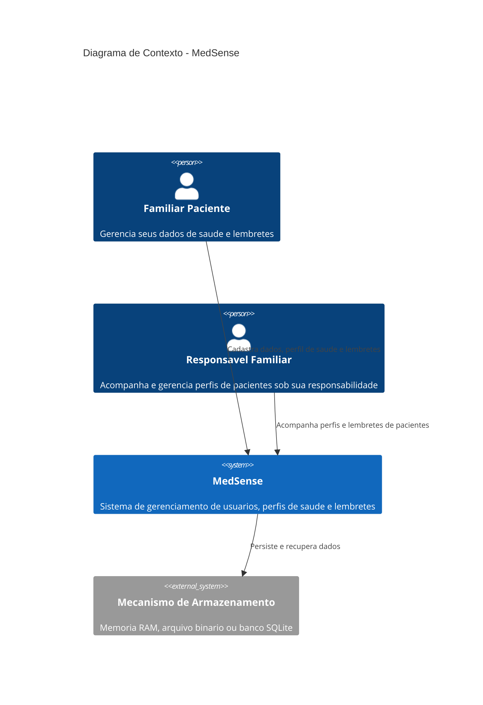
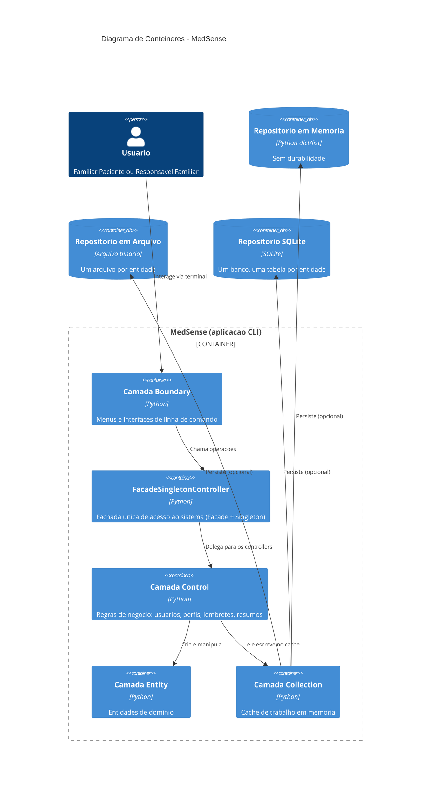
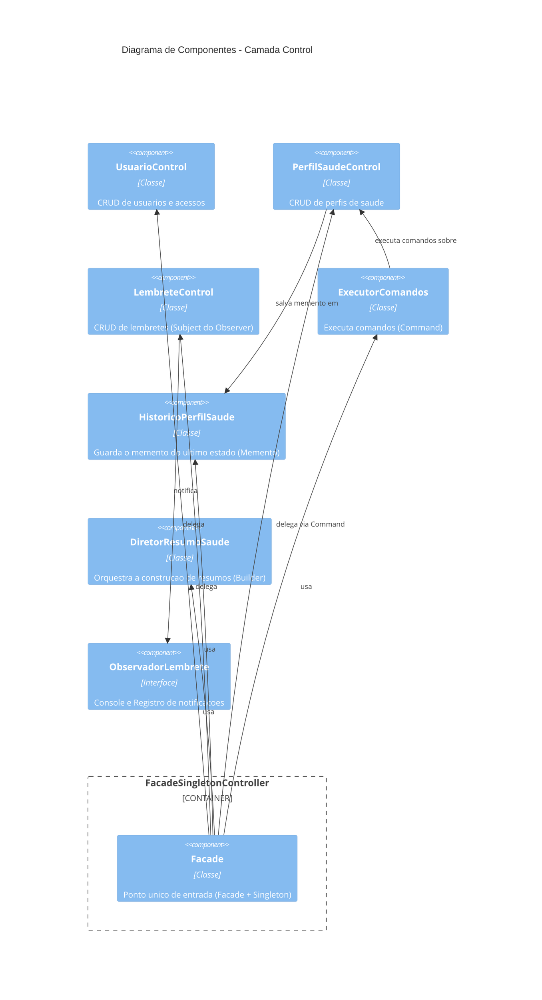
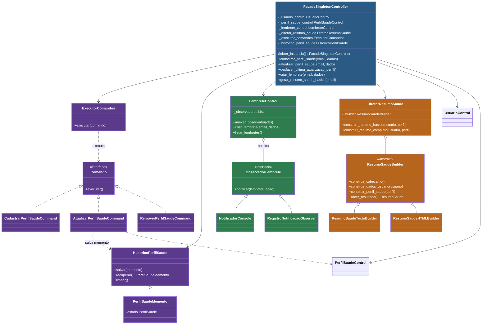

# MedSense

Sistema de gerenciamento de usuários, perfis de saúde e lembretes para clínicas e hospitais, desenvolvido em Python com arquitetura em camadas e aplicação de padrões de projeto (GoF).

---

## Sumário

- [Visão geral](#visão-geral)
- [Arquitetura](#arquitetura)
- [Padrões de projeto aplicados](#padrões-de-projeto-aplicados)
- [Diagramas C4](#diagramas-c4)
- [Diagrama de classes](#diagrama-de-classes)
- [Como executar](#como-executar)
- [Como rodar os testes](#como-rodar-os-testes)
- [Estrutura de pastas](#estrutura-de-pastas)
- [Contribuição](#contribuição)

---

## Visão geral

O MedSense permite que clínicas e hospitais gerenciem:

- **Usuários** — familiares de pacientes e responsáveis familiares, com cadastro, listagem e controle de acesso.
- **Perfis de saúde** — tipo sanguíneo, alergias, condições crônicas e medicamentos contínuos, com histórico de alterações e possibilidade de desfazer a última atualização.
- **Lembretes de saúde** — medicamentos, consultas e exames, com notificação automática de observadores a cada mudança de estado.
- **Resumos de saúde** — documentos gerados em texto ou HTML, reunindo dados do usuário, perfil e seções opcionais.

O sistema pode persistir dados em memória RAM, arquivo binário ou banco SQLite, escolhido no início da execução.

## Arquitetura

O projeto segue uma arquitetura em camadas (padrão BCE — Boundary, Control, Entity):

| Camada | Pasta | Responsabilidade |
|---|---|---|
| **Boundary** | `src/boundary/` | Interfaces de linha de comando (entrada e saída de dados) |
| **Control** | `src/control/` | Regras de negócio e orquestração |
| **Entity** | `src/entity/` | Dados e comportamentos das entidades do domínio |
| **Collection** | `src/collection/` | Armazenamento em memória (cache de trabalho) |
| **Infra** | `src/infra/` | Persistência, logging e adapters |

Toda a interação da camada `boundary` com o sistema passa por uma única fachada: `FacadeSingletonController`.

## Padrões de projeto aplicados

| Padrão | Onde | Papel |
|---|---|---|
| **Facade** | `control/facade_singleton_controller.py` | Unifica usuários, perfis, lembretes e resumos numa única interface para a camada de boundary |
| **Singleton** | `control/facade_singleton_controller.py` | Garante uma única instância da fachada durante toda a execução |
| **Command** | `control/comando.py`, `control/comandos_perfil_saude.py`, `control/executor_comandos.py` | Encapsula as operações de perfil de saúde (cadastrar, atualizar, remover) como objetos executáveis |
| **Memento** | `entity/perfil_saude_memento.py`, `control/historico_perfil_saude.py` | Guarda o estado anterior do perfil de saúde, permitindo desfazer a última atualização |
| **Observer** | `control/observadores_lembrete.py`, `control/lembrete_control.py` | Notifica observadores (console, registro) a cada criação, atualização ou conclusão de lembrete |
| **Builder** | `control/resumo_saude_builder.py` | Constrói resumos de saúde em texto ou HTML a partir da mesma receita de passos |
| **Abstract Factory** | `infra/persistencia/fabrica_repositorios.py` | Produz a família completa de repositórios (memória, arquivo, SQLite) sem expor as classes concretas |
| **Adapter** | `infra/logging_adapter.py` | Adapta a biblioteca de logging padrão à porta `Logger` usada pelo sistema |
| **Template Method** | `control/relatorio_acesso.py` | Define o esqueleto da geração de relatórios de acesso, com passos especializados por formato |

Cada padrão tem um ADR (Architecture Decision Record) correspondente em [`docs/adr/`](docs/adr/), documentando o contexto e a decisão de uso.

## Diagramas C4

### Nível 1 — Contexto



### Nível 2 — Contêineres



### Nível 3 — Componentes (Camada Control)



## Diagrama de classes

Diagrama de classes com cores por padrão de projeto (Facade/Singleton em azul, Command/Memento em roxo, Observer em verde, Builder em laranja):



> O diagrama de classes de análise completo (com as camadas Boundary, Control e Entity antes da aplicação dos padrões finais) está disponível em [`docs/classes-analise/`](docs/classes-analise/).

## Como executar

```bash
git clone https://github.com/diogo19025/medsense.git
cd medsense
python src/main.py
```

O sistema pergunta o mecanismo de armazenamento (memória, arquivo ou SQLite) e em seguida exibe o menu principal.

## Como rodar os testes

```bash
cd tests
python -m unittest discover -v
```

Ou individualmente:

```bash
python test_facade_singleton_controller.py
```

## Estrutura de pastas

```
medsense/
├── docs/
│   ├── adr/                  # Architecture Decision Records
│   └── classes-analise/      # Diagramas de análise (BCE)
├── src/
│   ├── boundary/              # Interfaces de linha de comando
│   ├── collection/            # Cache em memória
│   ├── control/                # Regras de negócio e padrões
│   ├── entity/                  # Entidades de domínio
│   └── infra/
│       └── persistencia/     # Repositórios (memória, arquivo, SQLite)
└── tests/                     # Testes unitários e de integração
```

## Contribuição

As práticas de branches, commits e pull requests do projeto estão documentadas em [`CONTRIBUTING.md`](CONTRIBUTING.md).